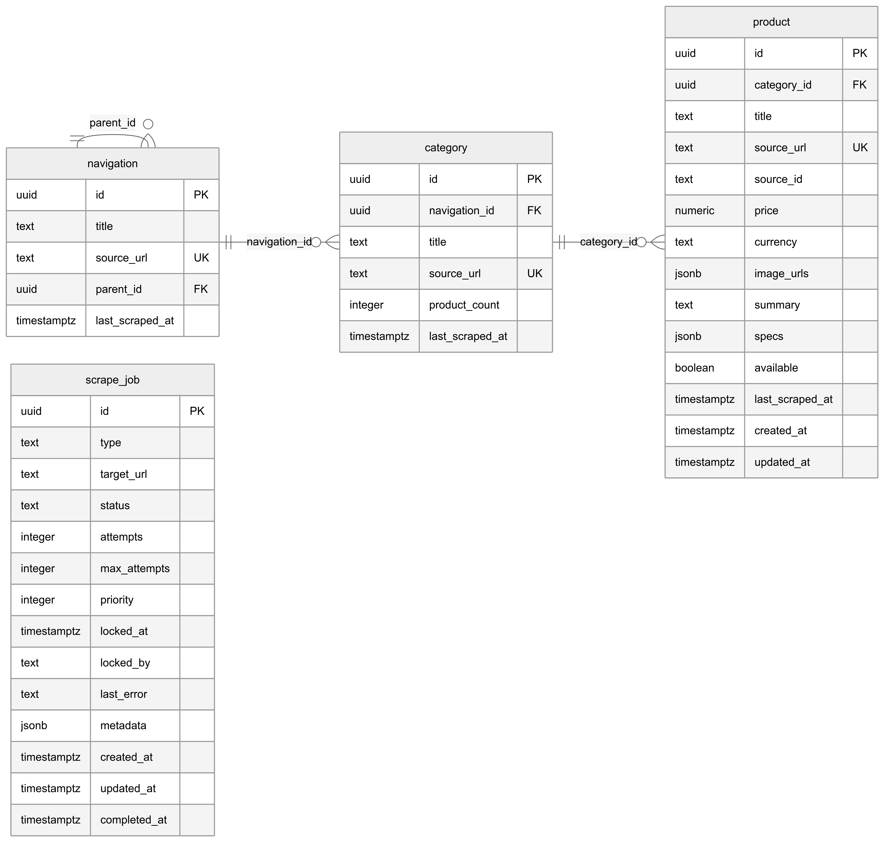

# Database Schema Documentation

DataShelf uses PostgreSQL (via Supabase) as its primary database. The schema is designed for efficient querying, data integrity, and scalability.

## Overview

The database consists of four main tables:
- `navigation` - Hierarchical site navigation structure
- `category` - Product categories with metadata
- `product` - Core product data with flexible specifications
- `scrape_job` - PostgreSQL-based job queue for scraping tasks

## Entity Relationship Diagram



## Table Definitions

### navigation

Stores the hierarchical navigation structure from World of Books.

```sql
CREATE TABLE navigation (
    id uuid PRIMARY KEY DEFAULT gen_random_uuid(),
    title text NOT NULL,
    source_url text UNIQUE NOT NULL,
    parent_id uuid REFERENCES navigation(id),
    last_scraped_at timestamptz DEFAULT now(),
    created_at timestamptz DEFAULT now(),
    updated_at timestamptz DEFAULT now()
);
```

**Columns:**
- `id`: Primary key (UUID)
- `title`: Display name of the navigation item
- `source_url`: Original URL from World of Books (unique)
- `parent_id`: Self-referencing foreign key for hierarchy
- `last_scraped_at`: When this navigation item was last scraped
- `created_at`: Record creation timestamp
- `updated_at`: Record last modification timestamp

**Indexes:**
```sql
CREATE INDEX idx_navigation_parent ON navigation(parent_id);
CREATE INDEX idx_navigation_url ON navigation(source_url);
```

**Example Data:**
```sql
INSERT INTO navigation (title, source_url, parent_id) VALUES
('Fiction', 'https://worldofbooks.com/fiction', NULL),
('Science Fiction', 'https://worldofbooks.com/fiction/sci-fi', 
 (SELECT id FROM navigation WHERE title = 'Fiction'));
```

---

### category

Stores product categories with metadata and product counts.

```sql
CREATE TABLE category (
    id uuid PRIMARY KEY DEFAULT gen_random_uuid(),
    navigation_id uuid REFERENCES navigation(id),
    title text NOT NULL,
    source_url text UNIQUE NOT NULL,
    product_count integer DEFAULT 0,
    last_scraped_at timestamptz DEFAULT now(),
    created_at timestamptz DEFAULT now(),
    updated_at timestamptz DEFAULT now()
);
```

**Columns:**
- `id`: Primary key (UUID)
- `navigation_id`: Foreign key to navigation table
- `title`: Category display name
- `source_url`: Original category URL (unique)
- `product_count`: Cached count of products in this category
- `last_scraped_at`: When this category was last scraped
- `created_at`: Record creation timestamp
- `updated_at`: Record last modification timestamp

**Indexes:**
```sql
CREATE INDEX idx_category_navigation ON category(navigation_id);
CREATE INDEX idx_category_url ON category(source_url);
CREATE INDEX idx_category_count ON category(product_count DESC);
```

**Triggers:**
```sql
-- Update product_count when products are added/removed
CREATE OR REPLACE FUNCTION update_category_product_count()
RETURNS TRIGGER AS $$
BEGIN
    IF TG_OP = 'INSERT' THEN
        UPDATE category 
        SET product_count = product_count + 1,
            updated_at = now()
        WHERE id = NEW.category_id;
        RETURN NEW;
    ELSIF TG_OP = 'DELETE' THEN
        UPDATE category 
        SET product_count = product_count - 1,
            updated_at = now()
        WHERE id = OLD.category_id;
        RETURN OLD;
    END IF;
    RETURN NULL;
END;
$$ LANGUAGE plpgsql;

CREATE TRIGGER trigger_update_category_count
    AFTER INSERT OR DELETE ON product
    FOR EACH ROW EXECUTE FUNCTION update_category_product_count();
```

---

### product

Core table storing product information with flexible JSONB fields.

```sql
CREATE TABLE product (
    id uuid PRIMARY KEY DEFAULT gen_random_uuid(),
    category_id uuid REFERENCES category(id),
    title text NOT NULL,
    source_url text UNIQUE NOT NULL,
    source_id text,
    price numeric(10,2),
    currency text DEFAULT 'GBP',
    image_urls jsonb DEFAULT '[]'::jsonb,
    summary text,
    specs jsonb DEFAULT '{}'::jsonb,
    available boolean DEFAULT true,
    last_scraped_at timestamptz DEFAULT now(),
    created_at timestamptz DEFAULT now(),
    updated_at timestamptz DEFAULT now()
);
```

**Columns:**
- `id`: Primary key (UUID)
- `category_id`: Foreign key to category table
- `title`: Product title/name
- `source_url`: Original product URL (unique constraint for deduplication)
- `source_id`: External product ID from World of Books
- `price`: Product price (numeric for precision)
- `currency`: Price currency (default GBP)
- `image_urls`: Array of image URLs stored as JSONB
- `summary`: Product description/summary
- `specs`: Product specifications stored as JSONB key-value pairs
- `available`: Product availability status
- `last_scraped_at`: When this product was last scraped
- `created_at`: Record creation timestamp
- `updated_at`: Record last modification timestamp

**Indexes:**
```sql
CREATE INDEX idx_product_category ON product(category_id);
CREATE INDEX idx_product_price ON product(price);
CREATE INDEX idx_product_available ON product(available);
CREATE INDEX idx_product_url ON product(source_url);
CREATE INDEX idx_product_scraped ON product(last_scraped_at);
CREATE INDEX idx_product_title ON product USING gin(to_tsvector('english', title));

-- JSONB indexes for specs
CREATE INDEX idx_product_specs_gin ON product USING gin(specs);
CREATE INDEX idx_product_author ON product USING gin((specs->>'author'));
CREATE INDEX idx_product_isbn ON product USING gin((specs->>'isbn'));
```

**JSONB Structure Examples:**

**image_urls:**
```json
[
  "https://r2.datashelf.com/images/product-1-main.jpg",
  "https://r2.datashelf.com/images/product-1-back.jpg",
  "https://r2.datashelf.com/images/product-1-detail.jpg"
]
```

**specs:**
```json
{
  "author": "Frank Herbert",
  "isbn": "978-0441172719",
  "publisher": "Ace Books",
  "pages": 688,
  "language": "English",
  "format": "Paperback",
  "publication_date": "1990-08-01",
  "dimensions": "4.2 x 1.2 x 6.9 inches",
  "weight": "11.2 ounces",
  "condition": "Very Good",
  "edition": "Mass Market Paperback"
}
```

**Constraints:**
```sql
ALTER TABLE product ADD CONSTRAINT check_price_positive 
    CHECK (price IS NULL OR price >= 0);

ALTER TABLE product ADD CONSTRAINT check_currency_valid 
    CHECK (currency IN ('GBP', 'USD', 'EUR'));

ALTER TABLE product ADD CONSTRAINT check_image_urls_array 
    CHECK (jsonb_typeof(image_urls) = 'array');
```

---

### scrape_job

PostgreSQL-based job queue for managing scraping tasks with distributed locking.

```sql
CREATE TABLE scrape_job (
    id uuid PRIMARY KEY DEFAULT gen_random_uuid(),
    type text NOT NULL CHECK (type IN ('navigation', 'category', 'product')),
    target_url text NOT NULL,
    status text NOT NULL DEFAULT 'queued' 
        CHECK (status IN ('queued', 'running', 'completed', 'failed')),
    attempts integer DEFAULT 0,
    max_attempts integer DEFAULT 3,
    priority integer DEFAULT 0,
    locked_at timestamptz,
    locked_by text,
    last_error text,
    metadata jsonb DEFAULT '{}'::jsonb,
    created_at timestamptz DEFAULT now(),
    updated_at timestamptz DEFAULT now(),
    completed_at timestamptz
);
```

**Columns:**
- `id`: Primary key (UUID)
- `type`: Job type (navigation, category, or product)
- `target_url`: URL to scrape
- `status`: Current job status
- `attempts`: Number of processing attempts
- `max_attempts`: Maximum retry attempts
- `priority`: Job priority (higher = more important)
- `locked_at`: Timestamp when job was locked by worker
- `locked_by`: Worker instance identifier
- `last_error`: Last error message if failed
- `metadata`: Additional job configuration as JSONB
- `created_at`: Job creation timestamp
- `updated_at`: Job last modification timestamp
- `completed_at`: Job completion timestamp

**Indexes for Queue Performance:**
```sql
-- Primary queue index for job selection
CREATE INDEX idx_scrape_job_queue ON scrape_job(status, priority DESC, created_at ASC) 
    WHERE status = 'queued';

-- Lock management
CREATE INDEX idx_scrape_job_locked ON scrape_job(locked_at) 
    WHERE locked_at IS NOT NULL;

-- Cleanup index
CREATE INDEX idx_scrape_job_cleanup ON scrape_job(completed_at) 
    WHERE status IN ('completed', 'failed');

-- General indexes
CREATE INDEX idx_scrape_job_status ON scrape_job(status);
CREATE INDEX idx_scrape_job_type ON scrape_job(type);
CREATE INDEX idx_scrape_job_url ON scrape_job(target_url);
```

**Queue Operations:**

**Get Next Job (with locking):**
```sql
SELECT id, type, target_url, metadata
FROM scrape_job 
WHERE status = 'queued' 
  AND (locked_at IS NULL OR locked_at < NOW() - INTERVAL '10 minutes')
ORDER BY priority DESC, created_at ASC 
FOR UPDATE SKIP LOCKED 
LIMIT 1;
```

**Lock Job for Processing:**
```sql
UPDATE scrape_job 
SET status = 'running', 
    locked_at = NOW(), 
    locked_by = $1,
    attempts = attempts + 1,
    updated_at = NOW()
WHERE id = $2;
```

**Complete Job:**
```sql
UPDATE scrape_job 
SET status = 'completed', 
    completed_at = NOW(), 
    locked_at = NULL, 
    locked_by = NULL,
    updated_at = NOW()
WHERE id = $1;
```

**Fail Job:**
```sql
UPDATE scrape_job 
SET status = CASE 
        WHEN attempts >= max_attempts THEN 'failed'
        ELSE 'queued'
    END,
    locked_at = NULL,
    locked_by = NULL,
    last_error = $2,
    updated_at = NOW()
WHERE id = $1;
```

---

## Views

### active_products

View for products that are available and recently scraped.

```sql
CREATE VIEW active_products AS
SELECT 
    p.*,
    c.title as category_title,
    n.title as navigation_title
FROM product p
JOIN category c ON p.category_id = c.id
JOIN navigation n ON c.navigation_id = n.id
WHERE p.available = true
  AND p.last_scraped_at > NOW() - INTERVAL '30 days';
```

### job_queue_stats

View for monitoring job queue health.

```sql
CREATE VIEW job_queue_stats AS
SELECT 
    status,
    type,
    COUNT(*) as count,
    AVG(attempts) as avg_attempts,
    MIN(created_at) as oldest_job,
    MAX(created_at) as newest_job
FROM scrape_job
GROUP BY status, type;
```

---

## Functions

### upsert_product

Function for inserting or updating products with conflict resolution.

```sql
CREATE OR REPLACE FUNCTION upsert_product(
    p_category_id uuid,
    p_title text,
    p_source_url text,
    p_source_id text DEFAULT NULL,
    p_price numeric DEFAULT NULL,
    p_currency text DEFAULT 'GBP',
    p_image_urls jsonb DEFAULT '[]'::jsonb,
    p_summary text DEFAULT NULL,
    p_specs jsonb DEFAULT '{}'::jsonb,
    p_available boolean DEFAULT true
) RETURNS uuid AS $$
DECLARE
    product_id uuid;
BEGIN
    INSERT INTO product (
        category_id, title, source_url, source_id, price, 
        currency, image_urls, summary, specs, available,
        last_scraped_at, updated_at
    ) VALUES (
        p_category_id, p_title, p_source_url, p_source_id, p_price,
        p_currency, p_image_urls, p_summary, p_specs, p_available,
        NOW(), NOW()
    )
    ON CONFLICT (source_url) DO UPDATE SET
        category_id = EXCLUDED.category_id,
        title = EXCLUDED.title,
        source_id = EXCLUDED.source_id,
        price = EXCLUDED.price,
        currency = EXCLUDED.currency,
        image_urls = EXCLUDED.image_urls,
        summary = EXCLUDED.summary,
        specs = EXCLUDED.specs,
        available = EXCLUDED.available,
        last_scraped_at = NOW(),
        updated_at = NOW()
    RETURNING id INTO product_id;
    
    RETURN product_id;
END;
$$ LANGUAGE plpgsql;
```

### enqueue_scrape_job

Function for adding jobs to the scraping queue.

```sql
CREATE OR REPLACE FUNCTION enqueue_scrape_job(
    p_type text,
    p_target_url text,
    p_priority integer DEFAULT 0,
    p_metadata jsonb DEFAULT '{}'::jsonb
) RETURNS uuid AS $$
DECLARE
    job_id uuid;
BEGIN
    -- Check if job already exists and is not completed/failed
    SELECT id INTO job_id
    FROM scrape_job
    WHERE target_url = p_target_url
      AND type = p_type
      AND status IN ('queued', 'running');
    
    IF job_id IS NOT NULL THEN
        -- Update priority if higher
        UPDATE scrape_job 
        SET priority = GREATEST(priority, p_priority),
            updated_at = NOW()
        WHERE id = job_id;
        RETURN job_id;
    END IF;
    
    -- Create new job
    INSERT INTO scrape_job (type, target_url, priority, metadata)
    VALUES (p_type, p_target_url, p_priority, p_metadata)
    RETURNING id INTO job_id;
    
    RETURN job_id;
END;
$$ LANGUAGE plpgsql;
```

---

## Maintenance

### Cleanup Old Jobs

```sql
-- Delete completed jobs older than 7 days
DELETE FROM scrape_job 
WHERE status IN ('completed', 'failed') 
  AND completed_at < NOW() - INTERVAL '7 days';
```

### Update Statistics

```sql
-- Update table statistics for query optimization
ANALYZE navigation;
ANALYZE category;
ANALYZE product;
ANALYZE scrape_job;
```

### Vacuum and Reindex

```sql
-- Vacuum tables to reclaim space
VACUUM ANALYZE navigation;
VACUUM ANALYZE category;
VACUUM ANALYZE product;
VACUUM ANALYZE scrape_job;

-- Reindex for performance
REINDEX TABLE product;
REINDEX TABLE scrape_job;
```

---

## Performance Considerations

### Query Optimization

1. **Use appropriate indexes** for common query patterns
2. **Limit result sets** with proper pagination
3. **Use JSONB operators** efficiently for specs queries
4. **Avoid N+1 queries** with proper JOINs

### JSONB Best Practices

```sql
-- Efficient JSONB queries
SELECT * FROM product WHERE specs->>'author' = 'Frank Herbert';
SELECT * FROM product WHERE specs ? 'isbn';
SELECT * FROM product WHERE specs @> '{"format": "Paperback"}';

-- Inefficient (avoid)
SELECT * FROM product WHERE specs::text LIKE '%Frank Herbert%';
```

### Connection Pooling

Configure Supabase connection pooling:
- **Transaction mode**: For short-lived connections
- **Session mode**: For persistent connections
- **Statement mode**: For simple queries

---

## Backup and Recovery

### Automated Backups

Supabase provides automated daily backups. For additional protection:

```sql
-- Export specific tables
COPY product TO '/backup/products.csv' WITH CSV HEADER;
COPY category TO '/backup/categories.csv' WITH CSV HEADER;
```

### Point-in-Time Recovery

Supabase supports point-in-time recovery up to 7 days (Pro plan).

### Data Validation

```sql
-- Check data integrity
SELECT COUNT(*) FROM product WHERE category_id NOT IN (SELECT id FROM category);
SELECT COUNT(*) FROM category WHERE navigation_id NOT IN (SELECT id FROM navigation);
SELECT COUNT(*) FROM scrape_job WHERE status NOT IN ('queued', 'running', 'completed', 'failed');
```