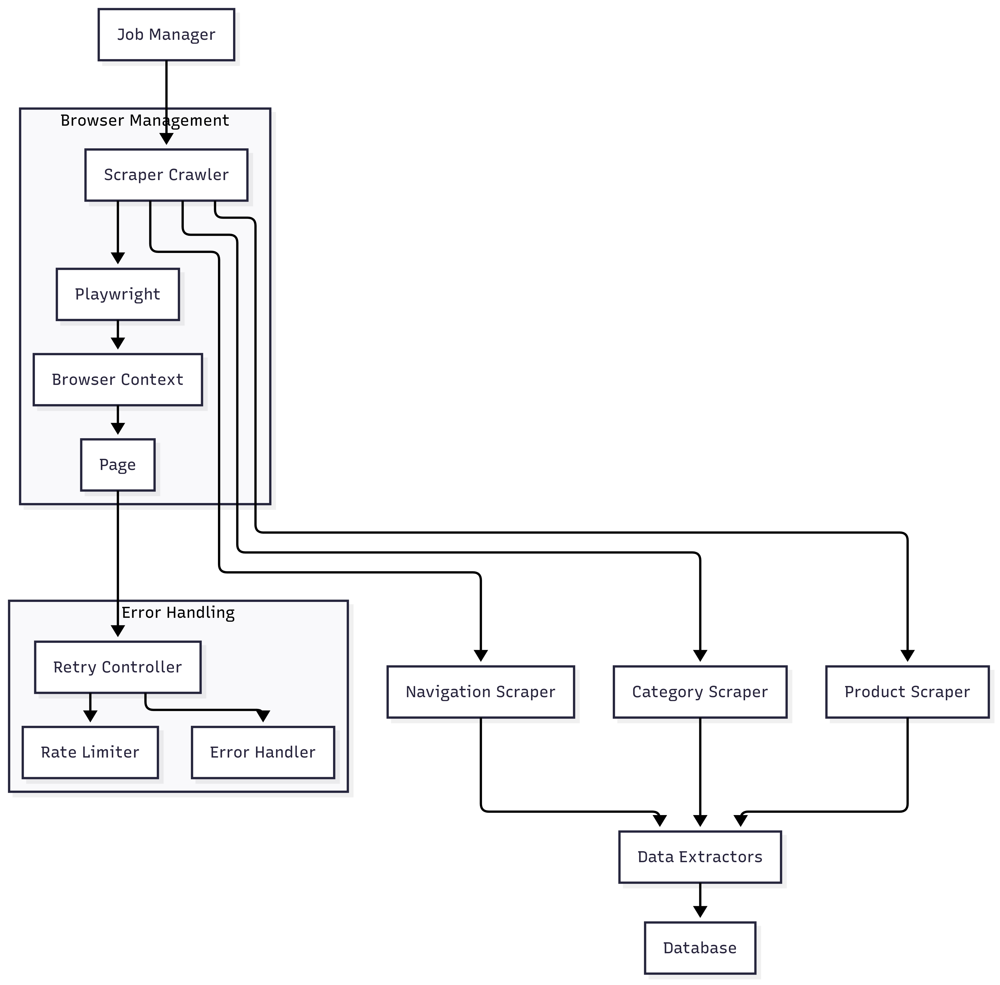

# Web Scraping Engine Documentation

## Overview

The DataShelf web scraping engine is built with Crawlee and Playwright to extract product data from the World of Books website. It provides a robust, scalable solution for scraping navigation, categories, and product information with comprehensive error handling and retry mechanisms.

## Architecture



### Core Components

1. **ScraperCrawler** (`src/services/crawler.ts`)
   - Wrapper around Playwright Crawler with World of Books optimizations
   - Handles browser configuration, request routing, and resource blocking
   - Implements retry logic and error recovery

2. **Scrapers** (`src/services/scrapers.ts`)
   - `NavigationScraper`: Extracts main category structure
   - `CategoryScraper`: Scrapes category pages and product listings
   - `ProductScraper`: Extracts detailed product information

3. **Data Extractors** (`src/utils/extractors.ts`)
   - Utility functions for parsing HTML and extracting structured data
   - Handles data cleaning, normalization, and validation
   - Optimized for World of Books page structures

## Features

### Browser Optimization
- Headless Chrome with optimized arguments for server environments
- Resource blocking (images, CSS, fonts) for faster scraping
- Realistic browser headers and viewport settings
- Anti-detection measures

### Data Extraction
- **Navigation**: Main category structure with hierarchical relationships
- **Categories**: Category information with product counts and pagination
- **Products**: Comprehensive product details including:
  - Title, price, currency, availability
  - Multiple product images
  - Product specifications (author, ISBN, publisher, etc.)
  - Product descriptions and summaries

### Error Handling
- Comprehensive retry logic with exponential backoff
- Browser crash recovery and session management
- Graceful handling of missing elements and timeouts
- Detailed error logging and monitoring

### Performance Features
- Concurrent scraping with configurable limits
- Distributed locking to prevent duplicate work
- Batch processing for multiple products
- Resource optimization and memory management

## Usage Examples

### Navigation Scraping
```typescript
import { NavigationScraper } from './services/scrapers';

const scraper = new NavigationScraper();
const navigation = await scraper.scrapeNavigation('job-id-123');

console.log(navigation);
// [
//   { title: 'Fiction', source_url: 'https://...', parent_id: undefined },
//   { title: 'Non-Fiction', source_url: 'https://...', parent_id: undefined }
// ]
```

### Category Scraping
```typescript
import { CategoryScraper } from './services/scrapers';

const scraper = new CategoryScraper();
const result = await scraper.scrapeCategory('https://worldofbooks.com/fiction', 'job-id-456');

console.log(result.category);
// { title: 'Fiction', source_url: '...', product_count: 150 }

console.log(result.products);
// [
//   { title: 'Book 1', url: '...', price: 12.99, currency: 'GBP' },
//   { title: 'Book 2', url: '...', price: 15.50, currency: 'GBP' }
// ]
```

### Product Scraping
```typescript
import { ProductScraper } from './services/scrapers';

const scraper = new ProductScraper();
const product = await scraper.scrapeProduct('https://worldofbooks.com/product/123', 'job-id-789');

console.log(product);
// {
//   title: 'The Hobbit',
//   source_url: '...',
//   price: 12.99,
//   currency: 'GBP',
//   image_urls: ['https://...', 'https://...'],
//   summary: 'A classic fantasy novel...',
//   specs: { author: 'J.R.R. Tolkien', isbn: '978-...', ... },
//   available: true
// }
```

### Batch Product Scraping
```typescript
const scraper = new ProductScraper();
const products = await scraper.scrapeProducts([
  'https://worldofbooks.com/product/123',
  'https://worldofbooks.com/product/456',
  'https://worldofbooks.com/product/789'
], 'batch-job-id');

console.log(`Scraped ${products.length} products`);
```

## Configuration

### Environment Variables
```bash
# Scraper Configuration
SCRAPER_USER_AGENT="DataShelf-Bot/1.0"
SCRAPER_CONCURRENT_JOBS=3
SCRAPER_REQUEST_DELAY=1000
SCRAPER_RETRY_ATTEMPTS=3

# World of Books Configuration
WOB_BASE_URL="https://www.worldofbooks.com"
WOB_RATE_LIMIT_DELAY=2000
```

### Crawler Options
```typescript
const crawler = new ScraperCrawler({
  maxRequestsPerCrawl: 100,
  maxConcurrency: 2,
  requestDelay: 1000,
  retryOnBlocked: true
});
```

## Data Structures

### ScrapedNavigation
```typescript
interface ScrapedNavigation {
  title: string;
  source_url: string;
  parent_id?: string;
}
```

### ScrapedCategory
```typescript
interface ScrapedCategory {
  title: string;
  source_url: string;
  product_count: number;
  navigation_id?: string;
}
```

### ScrapedProduct
```typescript
interface ScrapedProduct {
  title: string;
  source_url: string;
  source_id?: string;
  price?: number;
  currency?: string;
  image_urls: string[];
  summary?: string;
  specs: Record<string, any>;
  available: boolean;
  category_id?: string;
}
```

## Error Handling

### Retry Logic
- Network errors: Exponential backoff (1s, 2s, 4s, 8s)
- Rate limiting: Respects 429 responses with Retry-After headers
- Browser crashes: Automatic browser restart
- Timeouts: Configurable timeout handling

### Error Types
```typescript
class ScrapingError extends Error {
  constructor(
    message: string,
    public url: string,
    public jobId: string,
    public attempt: number,
    public originalError?: Error
  )
}
```

### Graceful Degradation
- Missing elements: Continue with partial data
- Invalid prices: Skip price information
- Missing images: Empty array
- Unavailable products: Mark as unavailable

## Testing

### Unit Tests
```bash
npm test -- --run extractors  # Test data extraction functions
npm test -- --run scrapers    # Test scraper classes
```

### Test Coverage
- Data extraction utilities with mock HTML fixtures
- Scraper classes with mocked browser interactions
- Error handling scenarios
- Edge cases and malformed data

### Mock Data
The test suite includes comprehensive mock HTML fixtures that simulate various World of Books page structures:
- Navigation menus
- Category listings
- Product grids with pagination
- Product detail pages
- Error scenarios

## Performance Considerations

### Resource Optimization
- Block unnecessary resources (images, CSS, fonts)
- Use minimal viewport size
- Disable unnecessary browser features
- Implement connection pooling

### Memory Management
- Automatic browser retirement after page count
- Session pool management
- Garbage collection optimization
- Resource cleanup on shutdown

### Scalability
- Horizontal scaling with multiple workers
- Distributed locking for URL-based coordination
- Queue-based job processing
- Monitoring and metrics collection

## Monitoring and Logging

### Structured Logging
```typescript
logger.info('Scraping navigation', { url, jobId });
logger.error('Navigation scraping failed', { url, error, jobId });
```

### Metrics
- Scraping success rates
- Processing times
- Error rates by type
- Resource usage statistics

### Health Checks
- Browser availability
- Memory usage
- Queue status
- Error thresholds

## Best Practices

### Rate Limiting
- Respect robots.txt
- Implement delays between requests
- Monitor response times
- Handle 429 responses appropriately

### Data Quality
- Validate extracted data
- Handle missing or malformed content
- Normalize data formats
- Implement data consistency checks

### Reliability
- Implement comprehensive error handling
- Use distributed locking for coordination
- Monitor system health
- Plan for graceful degradation

## Troubleshooting

### Common Issues

1. **Browser Launch Failures**
   - Check Docker configuration
   - Verify Playwright installation
   - Review browser arguments

2. **Extraction Failures**
   - Verify CSS selectors
   - Check page load timing
   - Review error logs

3. **Performance Issues**
   - Monitor resource usage
   - Check concurrent job limits
   - Review request delays

4. **Data Quality Issues**
   - Validate extraction logic
   - Check data normalization
   - Review test coverage

### Debug Mode
```bash
LOG_LEVEL=debug npm start
```

This will provide detailed logging for troubleshooting scraping issues.